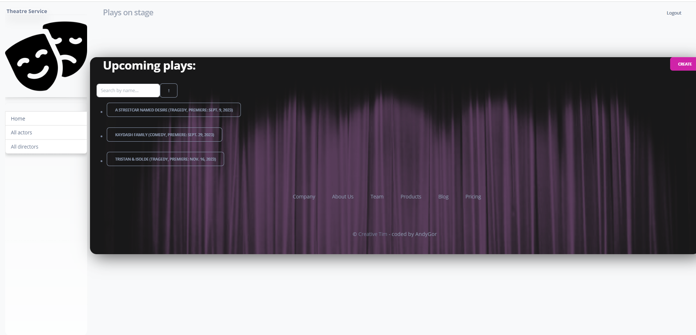

# Theatre service

- this project allows the theater community to plunge into the inner world of our theater,
take a look at his story and get acquainted with his immediate plans
 
## Check it out!

[Thetre service project](https://)

## Installation
Python3 must be already installed


```python
git clone://github.com/andy77andy/theatre
cd thetre
pythone -m venv venv 
source venv/bin/activate
pip install -r requirements/txt
python manage/py runserver
```
## Features
1. Authentication abilities for Actor/User
2. Managing theatre's inner life including play's details and upcoming plans
3. Convenient and friendly admin panel

NOTE: Attach screenshots of all created pages to pull request. It's important to attach images not links to them.

## Demo

